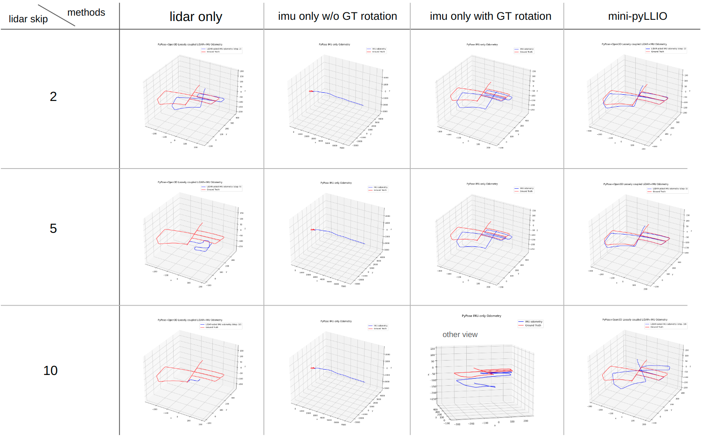
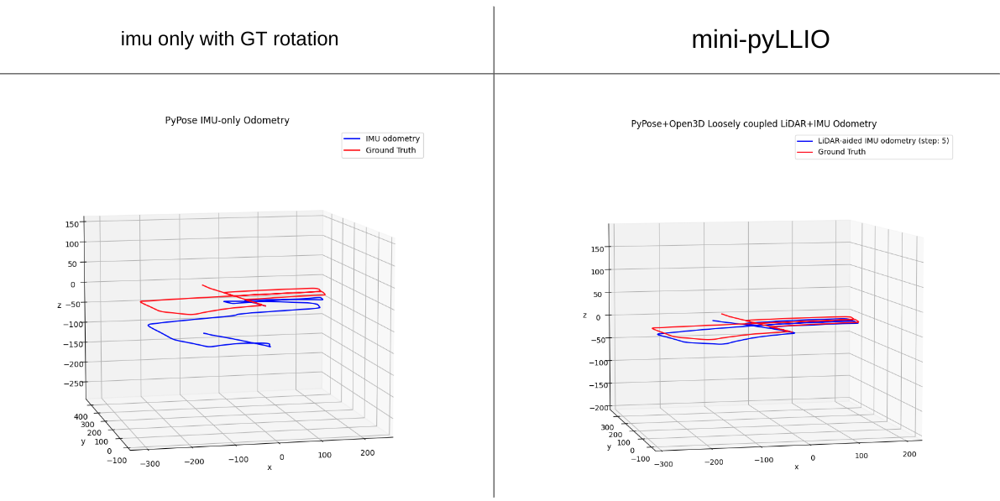

# mini-pyllio
- A very **mini**mal but working **Py**thon only implementation for **l**oosely-coupled **L**iDAR-**I**nertial **o**dometry for education purpose.

## What's this?
- Recently, [Pypose](https://github.com/pypose/pypose) supports a great example code for the imu integration with an easy-to-follow python-based code. see https://github.com/pypose/pypose/tree/main/examples/module/imu. This is called inertial odometry.
- In that example, the ground-truth rotation from the expensive GPS+INS system is injected into the propagtaion step.
  - As you will see below, without the external rotation source, the imu itself quickly diverges.
- I simply replaced it by scan-to-scan registration from LiDAR sensor (with Open3D ICP). Then, the corrected PVA (position, velocity, and attitude) is set as the estimator's newer state. I think this can be said loosely coupled lidar-inertial odometry.
  - The point is: LiDAR and IMU help each other.
    1. A LiDAR prevents an IMU diverges.
    2. The IMU provides a good initial guess for the LiDAR scan matching.
    - and then, the LiDAR again better prevents an IMU diverges... and go on and on ...
- This simple project, which only used Python and a few files, is intended to be educational.
  - I expect, after playing it, a reader could be able to answer why IMU and LiDAR should be fusioned. 

## How to use?
### The steps
1. Download the KITTI data from [KITTI dataset](https://www.cvlibs.net/datasets/kitti/raw_data.php).
2. Build an image: `cd docker && docker build .`
3. change the host-side volume path as yours in the docker_run.sh
4. Just `sh docker_run.sh`. Enjoy!

### You may like ...
- This [video-based](.)(TBA) guide.  

## Experiments on KITTI odometry dataset
### 05 (2011_09_30_0018)
1. Exhaustive comparisons
  - 
2. IMU only (with external GT rotation) vs. mini-pyllio
  - 

## Future work
- A set of additional efforts could enhance the speed/accruacy.
  - For example,
    1. I used scan-to-scan matching. Scan-to-submap matching would definitely helpful.
    2. Not explicit replacement of the state, but trying weighting the propagated state and the correction such as Kalman filter.
    3. Fusion with a cheap GPS.
- But, this is a minimal codebase for an educational purpose, thus I left them for you. Do it yourself!

## Contact
- Giseop Kim, `gisbi.kim@gmail.com`
